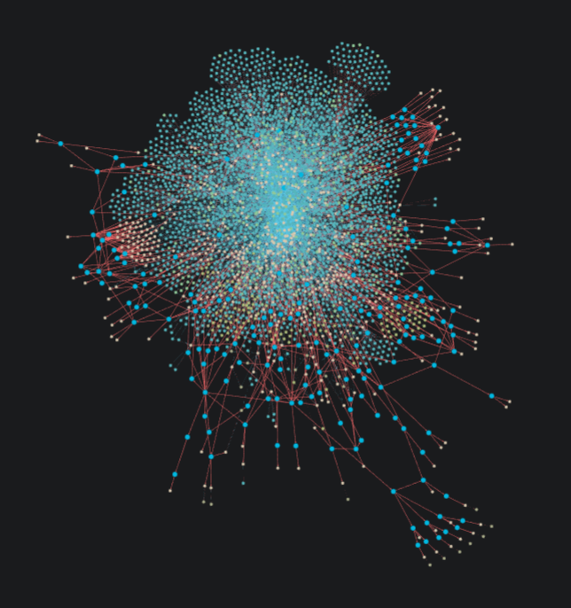

# 🧠 Context Machine – Local Infrastructure Setup

This project provides a complete **local infrastructure** for the Context Machine ecosystem, including:

- **MinIO** – S3-compatible object storage  
- **RabbitMQ** – Message broker for event routing  
- **n8n** – Workflow automation engine  
- **Neo4j** – Graph database for knowledge representation  
- **Neo4j Service (Flask API)** – REST API for nodes, edges, and bulk operations  
- **Analyzer Service** – Multi-language source code analyzer with AST parsing and recursive tree analysis  
- **WebSocket Service** – Publishes real-time progress updates for frontend dashboards  
- **Gitea** – Local Git hosting, API access, and repository management  
- **Ollama + OpenWebUI** – Local LLM runtime and chat interface for on-device AI code analysis  

All components run through **Docker Compose** and are automatically configured using setup scripts.  

> 🧩 The system currently enables you to generate an **AST graph** of your local code base — entirely offline.

Create a folder called `project` and put your source code inside to visualize structures like this:

No code leaves your machine — everything runs locally.  
Future AI components will also execute on-device.

---

## 🚀 Quick Start

### 1. Create `.env.local`

Example configuration:

~~~bash
# API Authentication
API_KEY=dev-key-123 

# MinIO
MINIO_ROOT_USER=minioadmin
MINIO_ROOT_PASSWORD=minioadmin
MINIO_BUCKET=incoming

# RabbitMQ
RABBITMQ_DEFAULT_USER=admin
RABBITMQ_DEFAULT_PASS=admin123
RABBITMQ_VHOST=/
RABBITMQ_EXCHANGE=file-events
RABBITMQ_QUEUE=file-processing
RABBITMQ_ROUTING_KEY=file.put

# n8n
N8N_BASIC_AUTH_ACTIVE=true
N8N_BASIC_AUTH_USER=admin
N8N_BASIC_AUTH_PASSWORD=admin123
N8N_ENCRYPTION_KEY=supersecretkey123
N8N_PORT=5678
N8N_ENFORCE_SETTINGS_FILE_PERMISSIONS=false
N8N_RUNNERS_ENABLED=true
N8N_BOOTSTRAP_EMAIL=foo@example.com
N8N_BOOTSTRAP_FIRSTNAME=bar
N8N_BOOTSTRAP_LASTNAME=foo
N8N_BOOTSTRAP_PASSWORD=A1234567
N8N_BOOTSTRAP_ROLE=global:owner

# Neo4j
NEO4J_AUTH=neo4j/test12345
DB_SQLITE_POOL_SIZE=2

# Analyzer ↔ Neo4j connection
SERVICE_NEO4J_URI=bolt://context-machine-neo4j:7687
SERVICE_NEO4J_AUTH=neo4j/test12345

# WebSocket Service
WS_HOST=0.0.0.0
WS_PORT=3010

# Gitea (Git service)
GITEA_HTTP_PORT=3005
GITEA_ADMIN_USER=gitea-admin
GITEA_ADMIN_PASSWORD=admin123
GITEA_ADMIN_EMAIL=admin@example.com

# Ollama + OpenWebUI
OLLAMA_MODEL=codellama:7b
OPENWEBUI_PORT=8080
~~~

---

### 2. Start the infrastructure

~~~bash
make up
~~~

This will:
- Build all service containers  
- Initialize MinIO, RabbitMQ, n8n, Neo4j, Gitea, Ollama, and OpenWebUI  
- Automatically create users, queues, buckets, and tokens  
- Pull and persist the configured Ollama model (`OLLAMA_MODEL`)  

When setup completes, you’ll see a summary like:

~~~
🚀 Context Machine is up and running
~~~

---

### 3. Start the Analyzer

~~~bash
curl -X POST http://localhost:3002/api/analyze \
  -H "Content-Type: application/json" \
  -H "X-API-Key: dev-key-123"
~~~

The analyzer will:
- Scan `/project` recursively  
- Create `:Folder` and `:File` nodes in Neo4j  
- Stream progress updates (1% steps) via `ws://localhost:3010/progress`

Example WebSocket events:
~~~json
{"percent": 1}
{"percent": 50}
{"percent": 100}
~~~

---

### 4. Access Service UIs

| Service | URL | Credentials |
|----------|-----|-------------|
| **MinIO** | [http://localhost:9001](http://localhost:9001) | `minioadmin / minioadmin` |
| **RabbitMQ** | [http://localhost:15672](http://localhost:15672) | `admin / admin123` |
| **n8n** | [http://localhost:5678](http://localhost:5678) | `admin / admin123` |
| **Neo4j Browser** | [http://localhost:7474](http://localhost:7474) | `neo4j / test12345` |
| **Neo4j Service API** | [http://localhost:3001/apidocs](http://localhost:3001/apidocs) | Header: `X-API-Key: dev-key-123` |
| **Analyzer Service API** | [http://localhost:3002/apidocs](http://localhost:3002/apidocs) | Header: `X-API-Key: dev-key-123` |
| **WebSocket Progress** | `ws://localhost:3010/progress?api_key=dev-key-123` | — |
| **Gitea** | [http://localhost:3005](http://localhost:3005) | `gitea-admin / admin123` |
| **Ollama** | [http://localhost:11434](http://localhost:11434) | Model: `codellama:7b` |
| **OpenWebUI** | [http://localhost:8080](http://localhost:8080) | Chat with your local model |

The Gitea API token (used for integrations) is saved at:
~~~
infra/gitea/admin_token.txt
~~~

---

### 5. Stop or Reset

Stop all services:
~~~bash
make down
~~~

Reset everything (delete all volumes & data):
~~~bash
make reset
~~~

---

## 🧩 Scripts

| Script | Purpose |
|--------|----------|
| `setup-minio.sh` | Creates MinIO buckets if missing |
| `setup-rabbitmq.sh` | Sets up vhost, users, exchanges, queues, bindings |
| `setup-minio-event.sh` | Configures AMQP notifications for MinIO |
| `setup-n8n.sh` | Bootstraps n8n and imports credentials |
| `setup-gitea.sh` | Ensures Gitea admin exists & generates API token |
| `setup-ollama.sh` | Starts Ollama container, pulls & persists model |
| `container-utils.sh` | Builds custom service containers |
| `messages.sh` | Colorized logging utilities |
| `progress.sh` | Displays progress bars during waits |

All scripts live under `infra/scripts/utils/`.

---

## 🧰 Useful Commands

### Logs
~~~bash
docker logs context-machine-minio
docker logs context-machine-rabbitmq
docker logs context-machine-n8n
docker logs context-machine-neo4j
docker logs context-machine-neo4j-service
docker logs context-machine-analyzer-service
docker logs context-machine-websocket-service
docker logs context-machine-gitea
docker logs context-machine-ollama
docker logs context-machine-openwebui
~~~

### Cleanup
~~~bash
docker rm -f $(docker ps -aq --filter name=context-machine)
docker volume prune -f
docker network prune -f
~~~

---

## 🧠 Notes

- Scripts are **idempotent** — safe to re-run anytime  
- `.env.local` changes take effect on next `make up`  
- Gitea now auto-provisions a token for API automation  
- Ollama models persist under `infra/ollama/` and are only downloaded once  
- All services run locally; nothing is sent to external servers  

---

## 🧼 Troubleshooting

**Error:**  
`Gitea is not supposed to be run as root`  
→ Fixed in current setup: all `docker exec` commands use UID 1000.  

**Error:**  
`CreateUser: name is reserved [admin]`  
→ Gitea already contains a default `admin` user.  
The setup script automatically switches to use `gitea-admin`.  

**Error:**  
`failed to bind port 0.0.0.0:11434`  
→ Ollama is already running locally. Either stop the host process or change the container port.  

**Progress bar not updating?**  
→ Check WebSocket service and API key. Test manually:  
~~~bash
echo '{"api_key":"dev-key-123","percent":42}' | nc localhost 3011
~~~

---

## 📜 License

**Business Source License 1.1 (BUSL 1.1)**  
Copyright (c) 2025 Jochen Schultz  

Licensed under the Business Source License 1.1 (the “License”).  
Full text: [https://mariadb.com/bsl11/](https://mariadb.com/bsl11/)

**Terms:**
- Internal & commercial use allowed for orgs ≤ **50 people**  
- Hosted/SaaS usage prohibited  
- Redistribution/resale prohibited  
- >50 employees → not permitted  

**Change Date:** October 4, 2028  
Automatically becomes **Apache License 2.0**

✅ Internal & small commercial use OK  
🚫 Large-scale/hosted use forbidden  
🕒 Open Source in 2028
